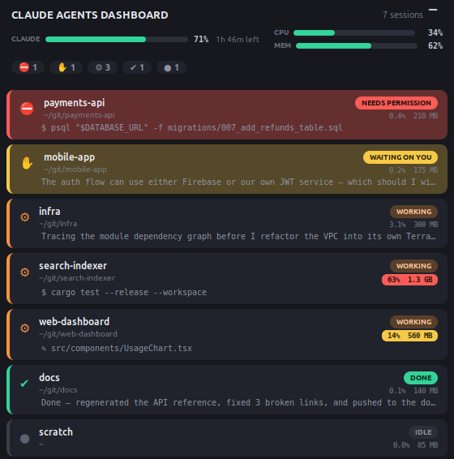

# Claude Agents Dashboard

A compact, always-visible desktop dashboard for [Claude Code](https://claude.com/claude-code).
It polls `claude agents --json` on an interval and shows one row per running
Claude Code session, so you can see what every agent is doing at a glance — and
get pulled back the moment one needs you.



<sub>Sessions above are illustrative. Attention states (needs-permission, waiting-on-you)
sort to the top with alarm-colored cards; a busy test run is flagged with a red CPU chip.</sub>

## What it shows

Per session:

- **Name** and **working directory**
- A **state badge** derived from the session's state + status
- A live **"currently working on"** line (tailed from the session transcript)
- The session's **CPU% and resident memory** — summed over the agent process
  *and all its children*, so an agent running tests or CI reflects the whole
  subtree. A hot session (CPU ≥ 10%) is highlighted yellow, ≥ 25% red.

In the header:

- Whole-machine **CPU + memory** meters
- A **Claude subscription usage** meter — a progress bar for the current
  5-hour rate-limit window, with a "resets in …" countdown

## Attention handling

Sessions that need *you* — waiting on a permission prompt or blocked on a
question — sort to the top, gently pulse, and raise the window. A sound plays
only once a session has kept waiting for more than a few seconds, so prompts you
answer right away stay silent.

## Requirements

- Python 3
- **GTK 3** + gobject-introspection (system packages — e.g. on Debian/Ubuntu:
  `sudo apt install python3-gi gir1.2-gtk-3.0`)
- The `claude` CLI on your `PATH`
- *(optional)* `canberra-gtk-play` for the attention sound

No pip packages, no build step — it's a single file.

## Usage

```sh
./agents_dashboard.py [--interval SECONDS] [--top] [--no-sound] [--no-desktop]
```

| Flag | Meaning |
| --- | --- |
| `--interval N` | poll every N seconds (default `1.0`) |
| `--top` | keep the window above all others and on every workspace |
| `--no-sound` | never play the attention sound |
| `--no-desktop` | skip installing the `.desktop` entry (used for the dock/taskbar icon) |

## Interacting with the window

- **Click a row** to expand/collapse its full activity line.
- **Click a header count chip** to filter to that category (multiple allowed;
  none = show all).
- **Esc** quits (in default mode; in `--top` mode use the window's close button).
- Drag the title bar or header body to move the window.
- The **`▔` toggle** in the top-right shows/hides the OS title bar.

## Notes

- The Claude usage meter reads the same undocumented `/usage` endpoint the
  interactive panel uses, authorised with your local OAuth token; it's polled
  with adaptive backoff because the endpoint is rate-limited.
- Everything lives in `agents_dashboard.py`. See `CLAUDE.md` for architecture
  and the non-obvious gotchas.
- The screenshot above is rendered from the real window with fake sessions and
  can be regenerated with `python3 docs/make_screenshot.py` (needs a display).
